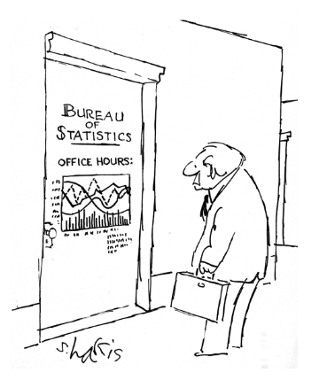

```{r setup, include=FALSE}
knitr::opts_chunk$set(echo = FALSE)
```

```{r, message=FALSE, warning=FALSE, echo=FALSE}
library(ggplot2)
theme_set(theme_grey() + theme(text=element_text(size = 20)))
```


## Deutsch oder Englisch

Up to you.

- Erste Vorlesungsslides sind auf Deutsch vorbereitet, aber ich kann auf Englisch dazu sprechen
- Grundlage ist das Buch (Springer 2017, auf Englisch)

\begin{center}
\includegraphics[width=0.48\textwidth]{screenshot_book}
\end{center}

## Zu meiner Person

- PhD in Techn. Math. an der Techn. Univ. Wien (TU Wien)
- Habilitation in Statistik TU Wien
- Arbeit im Methodenreferat der Statistik Austria
- Geoinformatik an der Palacky Univ. Olm\"utz
- Assoc.-Prof. am Institut f\"ur Statistics and Math. Methods in Economics, TU Wien (bis 2016)
- Dozent am Institut f\"ur Datenanalyse und Prozessdesign (IDP), Zuricher Hochschule f\"ur Angwandte Wissenschaften (ZHAW)

\pause 

Hobbies:

- R. CRAN Task View Official Statistics and Survey Methodology (https://cran.r-project.org/view=OfficialStatistics)
- Editor Austrian Journal of Statistics (https://www.ajs.or.at)
- Kunst. Malen.
- Biologie und Klimaforschung
- Bier (nur wissenschaftlich! ;-))

## Wissensstand 

- Was ist Euer Wissenstand bzgl. R?
- Wer hat welchen Background? (Statistik, Wirtschaftswissenschaften, Mathematik, Soziologie, ...?)
- Im welchen Semester?

## Administratives

Mai:

- 2 Vorlesungstage (9.5. und 10.5)
- Zuordnung von Aufgaben am Ende des zweiten Tages

Erste Juliwoche:

- 1.7. ganztags Vorlesung und 2.7. ev. nur halbtags
- Pr\"asentationen der Aufgaben am 3.7. von 12:00 bis 18:00 Uhr

Ende Juli:

- Abgabe der Ausarbeitung der Aufgaben

## Pr\"asentation und Ausarbeitung

- in Gruppen zu je 3 Studierenden
- Pr\"asentation der Aufgaben und (Teil)-L\"osungen, ca. 20 Min. P\"asentation und ca. 10 Min. Diskussion (genaue L\"ange wird noch fixiert)
- Nach Pr\"asentation: Einarbeitung der Kommentare und Ber\"ucksichtigung des Juli-Stoffes. Abgabe Bericht Ende Juli. Ca. 5 Seiten ohne Tabellen, Grafiken und Referenzen. Max 10 Seiten mit Tabellen, Grafiken, Referenzen.

Note:

- 50% Pr\"asentation, 50% Ausarbeitung

Wichtig:

- Wer hat was gemacht? Dies sollte klar in der Pr\"asentation und Ausarbeitung vermerkt sein.

## Art der Vorlesung und \"Ubung

- Ihre aktive Teilnahme ist erw\"unscht.
- Ideal: Lehrgespr\"ach statt Frontalunterricht
- Selbstst\"andige Ausarbeitungen zwischendurch
- Gr\"un markierte Kapitel im Buch sind speziell f\"ur diese Vorlesung wichtig.
- SDC ist machmal ein "trockener" Stoff. Trotzdem darf und soll in der Vorlesung auch gelacht werden. 

Das techn. Verst\"andnis der Methoden der Statistische Geheimhaltung (SDC) ist nur die halbe Miete. Die Anwendung ist datenspezifisch und erfordert Erfahrung mit Daten und erweitertes Verst\"andnis von SDC.


## Erreichbarkeit des Vortragenden (nur per Email)



## Inhaltliche Struktur der Vorlesung

- R und sdcMicro (get in touch, Buch Kapitel 1). Grunds\"atzlich aber sdcMicro und simPop Anwendungen nach Theorieteilen
- Basics (Buch Kapitel 2) und Rechtliches (Folien)
- Disclosure Risk (Buch Kapitel 3)
- Anonymisierungsmethoden (Buch Kapitel 4)
- Utility (Buch Kapitel 5)

Falls Zeit bleibt:

- Optional: Einblick in synthetische Datengenerierung 
- Optional: Case Studies
- Optional: Geheimhaltung in Tabellen
- Optional: Matching


## Let's start


